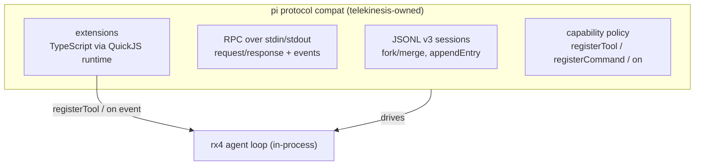
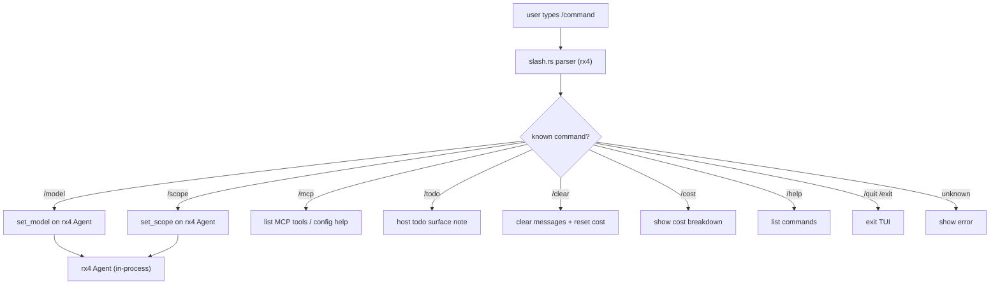

# telekinesis

## Product

**CLI + TUI host** for the **rotary (rx4)** agent harness engine.

- UX: minimal/fast (pi-first, codex second)
- TUI built with crepuscularity-tui (ratatui-based)
- No harness reimplementation — rx4 owns the loop
- **Owns pi protocol compat** (moved from rotary): JSONL v3 sessions, RPC
  over stdin/stdout, pi tool name mapping, extension protocol via QuickJS,
  capability policy, SDK surface

## Architecture

```mermaid
graph TD
  subgraph TK["telekinesis"]
    TUI["TUI (crepuscularity-tui)<br/>sidebar · themes · slash palette"]
    CLI["CLI<br/>login · exec · serve"]
    Pi["pi protocol compat<br/>JSONL v3 · RPC · extensions · QuickJS"]
    Slash["slash commands<br/>/model /scope /mcp /todo /clear /cost"]
  end
  TK -->|tokio channels (in-process)| RX4
  subgraph RX4["rx4 harness engine"]
    Loop["agent loop + streaming events"]
    Tools["tools + computer-use + MCP"]
    Prov["providers (OpenAI/Anthropic/Ollama)"]
    Sess["sessions · memory · graph memory"]
    Skills["skill engine + curator + background review"]
  end
```

## Stack

- **Rust** — the entire product is Rust
- crepuscularity-tui (`ui/tui`) — ratatui-based TUI with hot-reloadable
  `shell.crepus` template — **primary surface**
- **rx4** crate — rx4 0.3.12 from crates.io (features: providers, builtin-tools, computer-use, skills, graph-memory, mcp, ipc)
- tokio — async runtime, channels between TUI and agent loop
- **pi protocol compat** — owned here (moved out of rotary): JSONL v3
  sessions, RPC over stdin/stdout, extension protocol via QuickJS

## UI surfaces

| Surface | Path | Status | Notes |
|---|---|---|---|
| TUI | `ui/tui` | ✅ Active | Primary surface, ratatui-based, in-process rx4 |
| Web | `ui/web` | 🧪 Experimental | axum server, connects to rx4 via IPC socket |
| GUI | `ui/gui` | 🧪 Experimental | GPUI native window, connects to rx4 via IPC socket |

## Pi protocol layer



## Slash command flow



## Commands (required quality)

```bash
cd ui/tui && cargo build
cd ui/tui && cargo run
cd ui/tui && cargo test
cd ui/tui && cargo clippy
```

## Rules

- TUI uses rx4 **directly** (in-process, via tokio channels) — not IPC in
  the current implementation.
- New agent features land in **rotary (rx4)** first, then surface via slash
  commands here.
- Prefer small slash commands that map to rx4 methods.
- telekinesis owns pi protocol compat — rotary no longer carries it.
- Product layer surfaces: MCP config (`ui/tui/src/mcp_config.rs` + `/mcp`), approval args, OS sandbox policy — do not reimplement harness loop.
- No hard-coded API keys or telemetry.

## Commits

English Conventional Commits, e.g. `feat(tui): expose /scope and /permissions`.
