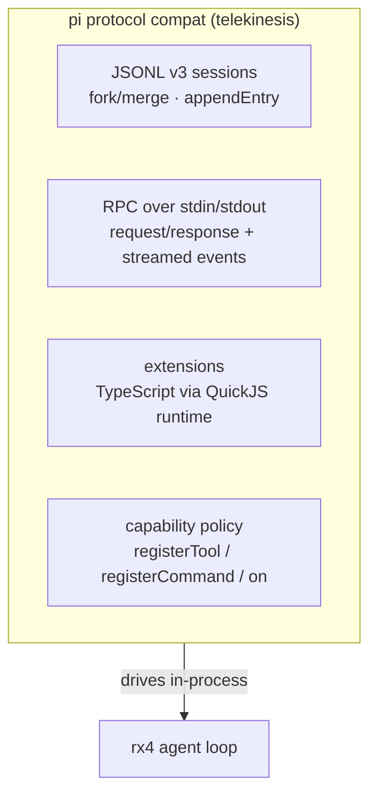
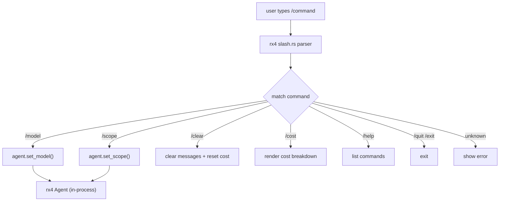

# telekinesis (tk)

[](LICENSE)
[](https://crates.io/crates/telekinesis)

**AI coding agent CLI + TUI.** Powered by the [rotary](https://github.com/tschk/rotary)
(rx4) harness engine and
[crepuscularity-tui](https://github.com/tschk/crepuscularity).

feel: **pi > codex > grok** — minimal, fast, typed event boundary. No
duplicate harness logic; rotary owns the loop. telekinesis owns the pi
protocol compat layer (moved out of rotary).

## Architecture

```mermaid
graph TD
  subgraph TK["telekinesis (host)"]
    TUI["TUI — crepuscularity-tui<br/>sidebar · themes · autocomplete · cost bar"]
    CLI["CLI — login · exec · serve"]
    Pi["pi protocol compat<br/>JSONL v3 sessions · RPC · extensions · QuickJS"]
    Slash["slash commands → rx4 methods"]
  end
  TK -->|tokio channels (in-process)| RX4
  subgraph RX4["rx4 (rotary) harness engine"]
    Loop["agent loop + streaming events"]
    Tools["builtin tools (7) + computer-use (13 cu_*)"]
    Skills["skill engine + curator + background review"]
    Router["model router (tiered)"]
    Multi["multi-agent coordination"]
    Clients["mcp + lsp clients"]
    Ctrl["scopes + permissions + hooks"]
  end
```

## Install / build

```bash
cd ui/tui && cargo build --release
# binary: ui/tui/target/release/tk
```

## Usage

```bash
# OAuth login (pick a provider)
tk login grok
tk login openai
tk login claude
tk login gemini
tk login copilot
tk login kimi
tk login antigravity

# start the TUI
tk

# or set an API key env var and run directly
XAI_API_KEY=... tk
```

## Pi protocol layer

telekinesis owns pi protocol compatibility (moved out of rotary):



## Slash command flow



## TUI features

| feature | description |
|---|---|
| sidebar (ctrl+b) | session list, tool list, plugin list |
| slash autocomplete | filtered command list as you type `/` |
| input history | up/down arrows, persisted to `~/.telekinesis/input_history.json` |
| permission prompts | y/n/always dialog when tools need approval |
| context usage bar | green/amber/red percentage of context window |
| cost tracking | running cost in status bar, `/cost` for breakdown |
| themes | auto, dark, light, dracula, nord, gruvbox, tokyo-night, catppuccin |
| streaming cursor | blinking cursor at end of streaming content |
| role colors | user=blue, assistant=green, tool=amber, system=zinc |
| tool call blocks | bordered blocks with tool name and args |
| diff blocks | green/red line coloring for file edits |
| keyboard shortcuts | ctrl+b/l/r, shift+tab, page up/down, home/end |

## TUI slash commands

| command | action |
|---|---|
| `/model [name]` | show / set model |
| `/scope <name>` | coding · research · plan · ask · computer_use |
| `/clear` | clear messages + reset cost |
| `/cost` | show cost breakdown |
| `/help` | list commands |
| `/quit` `/exit` | quit |

## Keyboard shortcuts

| key | action |
|---|---|
| `Enter` | submit prompt |
| `Ctrl+C` | interrupt / exit |
| `Ctrl+L` | clear screen |
| `Ctrl+B` | toggle header |
| `Up` / `Down` | input history |
| `PgUp` / `PgDn` | scroll chat view |
| `Home` / `End` | jump to top/bottom of chat |

## rx4 (rotary) features exposed

- agent loop + streaming events (tokio channels)
- built-in tools (7) + computer-use tools (`cu_*`, 13 — embedded rs_peekaboo)
- scopes, permissions, hooks, sessions, plugins/skills, providers
- **skill engine** — creates reusable skills from conversations, bayesian
  confidence tracking
- **background review** — observes turns, distills learning signals
- **skill curator** — lifecycle management (Active→Stale→Archived)
- **embeddings** — semantic skill matching (Gemini / Ollama)
- **graph memory** — knowledge graph with pagerank, community detection,
  dream consolidation
- **dream scheduler** — graph consolidation capability (host schedules)
- **model router** — tiered routing: lite, standard, heavy, subagent
- **multi-agent coordination** — coordinator/worker/reviewer/researcher roles
- **mcp client** — json-rpc 2.0 over stdio, tool routing
- **lsp client** — diagnostics, references, definition via json-rpc
- **prompt caching** — anthropic ephemeral cache_control
- **cost tracking** — per-model pricing registry, session cost breakdown
- **repo map** — pagerank-ranked symbol extraction
- **secret redaction** — detects api keys, tokens, private keys before output
- project instruction files (`agents.md` etc.) loaded on startup

## Layout

```
telekinesis/
  ui/tui/           Rust TUI (crepuscularity-tui + rx4)
  ui/gui/           optional GPUI (stub)
  ui/web/           optional web (stub)
  ui/shell.crepus   hot-reloadable TUI template
  plugins/          TypeScript plugin system (pi-compatible)
  db/               Turso/SQLite service
  docs/             architecture docs
  references/       git submodules (t3code, pi, zed, opencode, crush, zero)
```

## OAuth providers

| provider | flag |
|---|---|
| grok (xai) | `tk login grok` |
| openai (chatgpt) | `tk login openai` |
| claude (anthropic) | `tk login claude` |
| gemini (google) | `tk login gemini` |
| copilot (github) | `tk login copilot` |
| kimi (moonshot) | `tk login kimi` |
| antigravity | `tk login antigravity` |

## Why this split

| concern | owner |
|---|---|
| loop, tools, providers, permissions, computer-use | **rotary (rx4)** |
| cli, tui, pi protocol compat, multi-device product, branding | **telekinesis** |

Inspired by t3code's typed ui/runtime boundary, codex noninteractive +
approvals, opencode multi-provider sessions, zero's tui, crush's hooks,
grok-build's dream memory — implemented as a thin host on a solid harness
engine.

## License

MPL-2.0
