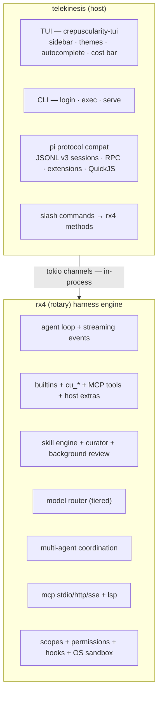
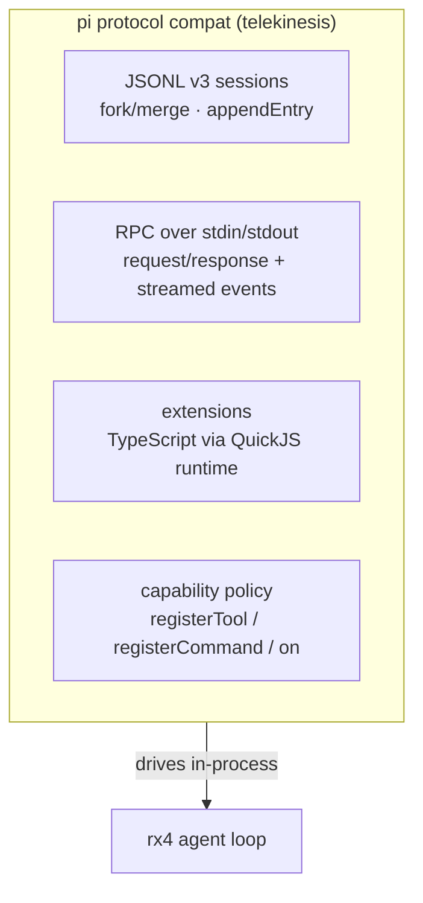
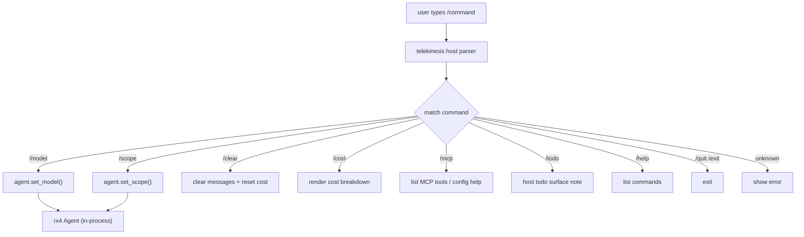

# telekinesis (tk)

[](LICENSE)
[](https://crates.io/crates/telekinesis)

**AI coding agent CLI + TUI.** Powered by the [rotary](https://github.com/tschk/rotary)
(rx4) harness engine and
[crepuscularity-tui](https://github.com/tschk/crepuscularity).

feel: **pi > codex > grok** — minimal, fast, typed event boundary. No
duplicate harness logic; rotary owns the loop. telekinesis owns the pi
protocol compat layer (moved out of rotary).

## Architecture


```mermaid
flowchart TD
  subgraph TK["telekinesis (host)"]
    TUI["TUI — crepuscularity-tui<br/>sidebar · themes · autocomplete · cost bar"]
    CLI["CLI — login · exec · serve"]
    Pi["pi protocol compat<br/>JSONL v3 sessions · RPC · extensions · QuickJS"]
    Slash["slash commands → rx4 methods"]
  end
  TK -->|"tokio channels — in-process"| RX4
  subgraph RX4["rx4 (rotary) harness engine"]
    Loop["agent loop + streaming events"]
    Tools["builtins + cu_* + MCP tools + host extras"]
    Skills["skill engine + curator + background review"]
    Router["model router (tiered)"]
    Multi["multi-agent coordination"]
    Clients["mcp stdio/http/sse + lsp"]
    Ctrl["scopes + permissions + hooks + OS sandbox"]
  end
```

## Documentation

- [Documentation index](docs/README.md) — product boundary, feature inventory, and verification commands.
- [Architecture](docs/ARCHITECTURE.md) — UI, OAuth, pi-compat, and rx4 execution path.
- [Rotary integration](docs/ROTARY.md) — the embedded harness contract and supported rx4 APIs.

## Install / build

```bash
cd ui/tui && cargo build --release
# binary: ui/tui/target/release/tk
```

## Usage

```bash
# OAuth login (pick a provider)
tk login grok
tk login openai
tk login claude
tk login gemini
tk login copilot
tk login kimi
tk login antigravity

# start the TUI
tk

# or set an API key env var and run directly
XAI_API_KEY=... tk
```

## Pi protocol layer

telekinesis owns pi protocol compatibility (moved out of rotary):


```mermaid
flowchart TD
  subgraph Pi["pi protocol compat (telekinesis)"]
    Sess["JSONL v3 sessions<br/>fork/merge · appendEntry"]
    RPC["RPC over stdin/stdout<br/>request/response + streamed events"]
    Ext["extensions<br/>TypeScript via QuickJS runtime"]
    Cap["capability policy<br/>registerTool / registerCommand / on"]
  end
  Pi -->|drives in-process| RX4["rx4 agent loop"]
```

## Slash command flow


```mermaid
flowchart TD
  Type["user types /command"] --> Parse["telekinesis host parser"]
  Parse --> Match{"match command"}
  Match -->|/model| M["agent.set_model()"]
  Match -->|/scope| S["agent.set_scope()"]
  Match -->|/clear| C["clear messages + reset cost"]
  Match -->|/cost| Co["render cost breakdown"]
  Match -->|/mcp| Mcp["list MCP tools / config help"]
  Match -->|/todo| Todo["host todo surface note"]
  Match -->|/help| H["list commands"]
  Match -->|/quit /exit| Q["exit"]
  Match -->|unknown| E["show error"]
  M --> Agent["rx4 Agent (in-process)"]
  S --> Agent
```

## TUI features

| feature | description |
|---|---|
| sidebar (ctrl+b) | session list, tool list, plugin list |
| slash autocomplete | filtered command list as you type `/` |
| input history | up/down arrows, persisted to `~/.telekinesis/input_history.json` |
| permission prompts | y/n/always dialog; shows tool name **and arguments** (`ApprovalRequest.arguments`) |
| plan approval | whole-turn rx4 preview before tool execution; y/n in the TUI |
| context usage bar | green/amber/red percentage of context window |
| cost tracking | running cost in status bar, `/cost` for breakdown |
| themes | auto, dark, light, dracula, nord, gruvbox, tokyo-night, catppuccin |
| streaming cursor | blinking cursor at end of streaming content |
| role colors | user=blue, assistant=green, tool=amber, system=zinc |
| tool call blocks | bordered blocks with tool name and args |
| diff blocks | green/red line coloring for file edits |
| keyboard shortcuts | ctrl+b/l/r, shift+tab, page up/down, home/end |

## TUI slash commands

| command | action |
|---|---|
| `/model [name]` | show / set model (persisted across sessions) |
| `/config` | interactive config menu (model · scope · effort · login) |
| `/config show` | print runtime configuration + auth status |
| `/scope <name>` | coding · research · plan · ask · computer_use (persisted) |
| `/plan <task>` | read-only implementation plan with files, risks, and checks |
| `/review [target]` | read-only findings-only review of a target or workspace |
| `/budget [<cost>\|cost <usd>\|time <seconds>\|turns <count>\|clear]` | bound cost, duration, or tool iterations |
| `/plan-approval ask\|bypass\|off` | review, automatically allow, or disable whole-turn plan gates |
| `/mcp` | list connected MCP tools + `~/.telekinesis/mcp.json` help |
| `/todo` | host surface note (engine todo tool when available) |
| `/sessions` | list JSONL sessions for this project (newest first) |
| `/resume <n>` | switch to a session listed by `/sessions` |
| `/clear` | clear messages + reset cost |
| `/cost` | show cost breakdown |
| `/help` | list commands |
| `/commands [name]` | list commands / show usage for one (alias of `/help`) |
| `/quit` `/exit` | quit |

Slash suggestions show each command's description (pi-style); typing
`/model <partial>` fuzzy-completes model names across configured providers.

The TUI enables whole-turn plan approval by default when a turn contains tool
calls. Set `TK_PLAN_APPROVAL=off` for non-interactive compatibility or
`TK_PLAN_APPROVAL=bypass` for an explicit yolo mode; `/plan-approval` changes
the setting for the current session.

Tool exposure can be narrowed at startup with `TK_TOOL_PROFILE=minimal|coding|full`;
the default remains the full backwards-compatible registry. `minimal` keeps
built-ins and configured MCP tools, while `coding` also enables subagents.

## Keyboard shortcuts

| key | action |
|---|---|
| `Enter` | submit prompt |
| `Shift+Enter` | new line |
| `Esc` | cancel task / close menus / clear input |
| `Ctrl+C` | interrupt / clear draft (press again with empty input to exit) |
| `Ctrl+L` | clear screen |
| `Ctrl+B` | toggle header |
| `←` / `→` | move input cursor |
| `Ctrl+←` / `Ctrl+→` (or `Alt+←/→`) | move by word |
| `Home` / `End` | cursor to start / end of input |
| `Ctrl+Home` / `Ctrl+End` | jump to top / bottom of chat |
| `Ctrl+A` / `Ctrl+E` | cursor to start / end of input |
| `Ctrl+K` / `Ctrl+U` | delete to end / start of input |
| `Ctrl+W`, `Ctrl+Backspace`, `Alt+Backspace` | delete word backwards |
| `Ctrl+Z` | undo last edit |
| `Delete` | delete character after cursor |
| `Up` / `Down` | input history |
| `Shift+Tab` | cycle reasoning effort |
| `Alt+Shift+←/→` | cycle agent scope (coding → research → plan → ask → computer_use) |
| `PgUp` / `PgDn` | scroll chat view |

Model selector: type to search **across all configured providers** with
fuzzy ranking (`provider`, `provider/id`, and bare id all match — e.g. `codex 55`
finds `gpt-5.5`); the provider rails collapse while a query is active.
`←/→` provider, `↑/↓` model, `Enter` apply, `Esc` cancel. Model, scope and
effort are persisted to `~/.telekinesis/prefs.json` and restored on the next
launch.

## rx4 (rotary) features exposed

- agent loop + streaming events (tokio channels)
- built-in tools (`read`/`write`/`edit`/`bash`/`grep`/`find`/`ls`) + computer-use (`cu_*`, 13 — Praefectus)
- host may also surface engine extras when registered: `web_fetch`, `todo`, `spawn_agent`, plan-scope tools, LSP tools
- scopes, permissions (approvals include tool args), lifecycle hooks (observe; deny/modify when engine gates), sessions, plugins/skills, providers
- OS sandbox via `Policy.enable_os_sandbox` + `Agent::enable_os_sandbox` (seatbelt/bwrap)
- **skill engine** — creates reusable skills from conversations, bayesian
  confidence tracking
- **background review** — observes turns, distills learning signals
- **bundled workflow skill** — inspect, plan, implement, and verify guidance, auto-activated from `skills/`
- **skill curator** — lifecycle management (Active→Stale→Archived)
- **embeddings** — semantic skill matching (Gemini / Ollama)
- **graph memory** — knowledge graph with pagerank, community detection,
  dream consolidation
- **dream scheduler** — graph consolidation capability (host schedules)
- **model router** — tiered routing: lite, standard, heavy, subagent
- **multi-agent coordination** — coordinator/worker/reviewer/researcher roles
- **mcp client** — json-rpc 2.0 over stdio/http/sse (engine); host loads `~/.telekinesis/mcp.json` best-effort at startup and registers `mcp__{server}__{tool}`.
- **lsp client** — diagnostics, references, definition via json-rpc
- **prompt caching** — anthropic ephemeral cache_control
- **cost tracking** — per-model pricing registry, session cost breakdown
- **repo map** — pagerank-ranked symbol extraction
- **secret redaction** — detects api keys, tokens, private keys before output
- project instruction files (`agents.md` etc.) loaded on startup

## Layout

```
telekinesis/
  ui/tui/           Rust TUI (crepuscularity-tui + rx4)
  ui/gui/           optional GPUI (stub)
  ui/web/           optional web (stub)
  ui/shell.crepus   hot-reloadable TUI template
  plugins/          TypeScript plugin system (pi-compatible)
  db/               Turso/SQLite service
  docs/             architecture docs
  references/       git submodules (t3code, pi, zed, opencode, crush, zero)
```

## OAuth providers

| provider | flag |
|---|---|
| grok (xai) | `tk login grok` |
| openai (chatgpt) | `tk login openai` |
| claude (anthropic) | `tk login claude` |
| gemini (google) | `tk login gemini` |
| copilot (github) | `tk login copilot` |
| kimi (moonshot) | `tk login kimi` |
| antigravity | `tk login antigravity` |

## Why this split

| concern | owner |
|---|---|
| loop, tools, providers, permissions, computer-use | **rotary (rx4)** |
| cli, tui, pi protocol compat, multi-device product, branding | **telekinesis** |

Inspired by t3code's typed ui/runtime boundary, codex noninteractive +
approvals, opencode multi-provider sessions, zero's tui, crush's hooks,
grok-build's dream memory — implemented as a thin host on a solid harness
engine.

## License

MPL-2.0
