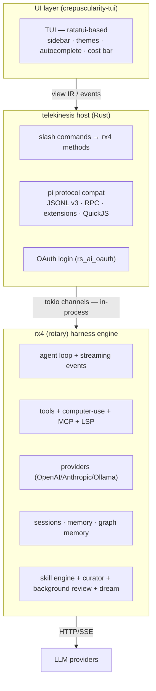
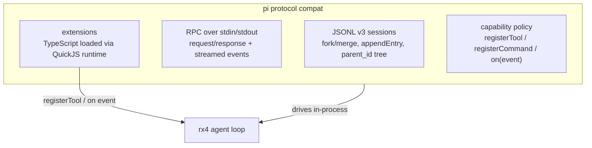
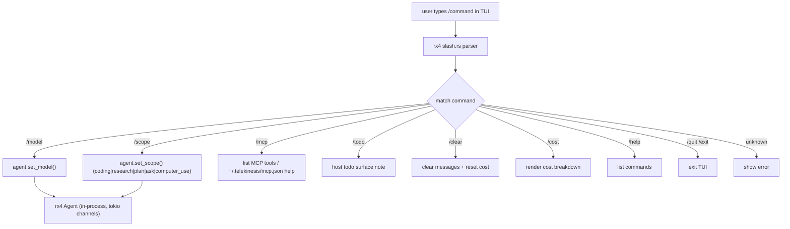

# telekinesis — architecture

> The original Zig-based plan has been replaced. telekinesis is now a Rust
> CLI + TUI host for the rx4 (rotary) harness engine.

## Goal

A minimal, fast AI coding agent CLI + TUI. pi-first UX, codex second. No
harness reimplementation — rx4 owns the loop.

## Layers

## Pi protocol layer (telekinesis-owned)

telekinesis owns pi protocol compatibility, moved out of rotary:

- **Extensions**: TypeScript/JavaScript modules loaded via QuickJS. Host
  exposes a `Host` vtable translating pi-style capabilities
  (`registerTool`, `registerCommand`, `on`, `sendMessage`, `appendEntry`,
  `setModel`) into rx4 calls.
- **Skills**: pure Markdown capability packs (`SKILL.md`, YAML frontmatter),
  injected into the system prompt as `<available_skills>`. Distinct from
  extensions — passive knowledge, no tool registration.
- **Event lifecycle** (pi-aligned naming):
  `before_agent_start → agent_start → turn_start → message_start →
  message_update* → message_end → tool_call → tool_execution_start →
  tool_execution_end → tool_result → turn_end → agent_end`

## Slash command flow

## Wire to rx4

- rx4 is a **path Cargo dependency** to local rotary (`../../../rotary`) with
  features `providers`, `builtin-tools`, `computer-use`, `skills`,
  `graph-memory`, `mcp`, `ipc` — bump crates.io when published.
- `ui/tui/src/main.rs` imports rx4 directly and drives the agent loop
  in-process via tokio channels — not IPC in the current implementation.
- builtins + computer-use registered at startup; MCP stdio from
  `mcp_config.rs` best-effort; approvals render `ApprovalRequest.arguments`;
  OS sandbox via `Policy.with_os_sandbox(true)` + `enable_os_sandbox()`.
- Hooks observe lifecycle; engine does not yet return deny/modify from hooks.

## Decisions

- **In-process, not IPC**: TUI talks to rx4 via tokio channels. Simpler,
  lower latency for a single-user local TUI.
- **pi compat owned here**: rotary is a pure harness engine; protocol
  compat is a host concern.
- **crepuscularity-tui**: ratatui-based with a hot-reloadable `shell.crepus`
  template — same template can target other surfaces later.
- **New agent features land in rx4 first**, then surface via slash commands
  here.
