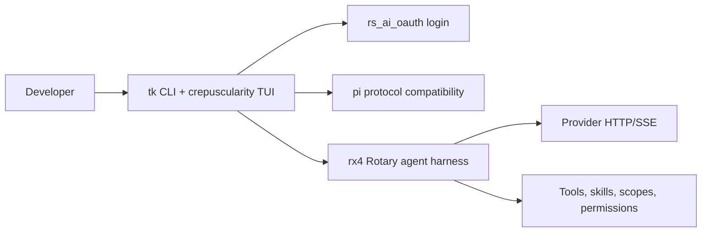

# telekinesis documentation

telekinesis is the MPL-2.0 CLI and TUI product. Its executable is `tk`; rotary is an embedded library dependency named `rx4`, not a second product binary.



## Guides

- [Architecture](ARCHITECTURE.md) — product layers and the in-process event path.
- [Rotary integration](ROTARY.md) — the host/engine boundary and the rx4 API used by the TUI.

## Feature inventory

- OAuth login for Grok, OpenAI, Claude, Gemini, Copilot, Kimi, and Antigravity.
- Rust TUI with streaming Markdown, slash-command autocomplete, sessions, themes, context usage, cost tracking, tool blocks, and permission prompts that show tool **arguments**.
- Pi-compatible JSONL v3 sessions, stdin/stdout RPC, extensions via QuickJS, and capability policy.
- In-process rx4 agent loop with scopes, builtins + computer-use + MCP tools (stdio/http/sse from `~/.telekinesis/mcp.json`), OS sandbox policy, skills, graph memory, LSP, model routing, multi-agent coordination, and secret redaction.
- Slash: `/model`, `/scope` (incl. plan), `/mcp`, `/todo`, `/cost`, `/clear`, `/help`, `/quit`.

## Verification

```bash
cd ui/tui
cargo build
cargo test
cargo clippy
```

For an authenticated smoke test, run `tk login grok`, then start `tk` and verify a streamed response. OAuth approval remains in the user's browser and is not part of an unattended test.
